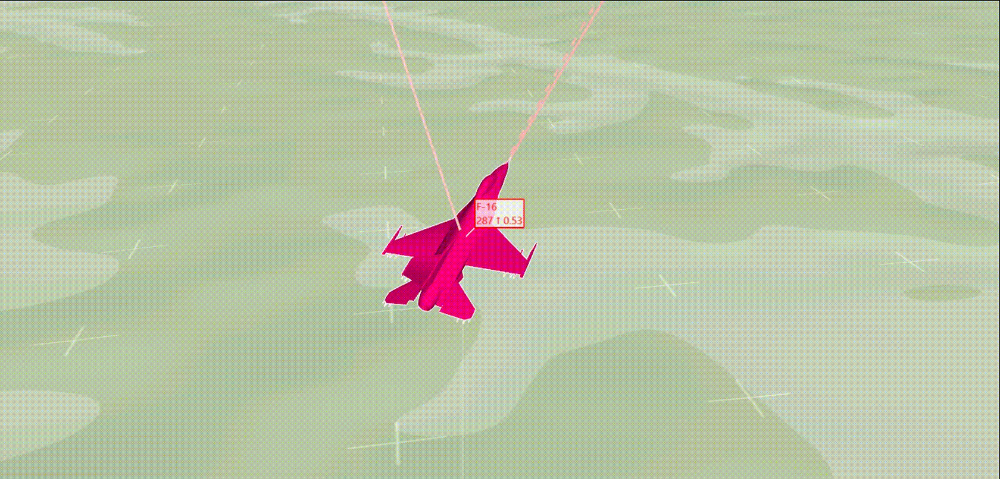

# Light Aircraft Game: A lightweight, scalable, gym-wrapped aircraft competitive environment with baseline reinforcement learning algorithms

## 开发日志

声明：原仓库为https://github.com/liuqh16/CloseAirCombat.git ，此仓库纯属个人倒腾，随便记录一下

小目标：

### 1、做到实时渲染，达到训练过程可视化的目的

首先需要看看正常情况它是怎么渲染的，我们先专攻heading

``` python
python scripts/train/train_jsbsim.py --env-name SingleControl --algorithm-name ppo --scenario-name 1/heading \
    --experiment-name v1 --seed 1 --n-training-threads 1 --n-rollout-threads 4  --cuda --log-interval 1 --save-interval \
    1 --num-mini-batch 5 --buffer-size 3000 --num-env-steps 1e8 --lr 3e-4 --gamma 0.99 --ppo-epoch 4 --clip-params 0.2 \
 --max-grad-norm 2 --entropy-coef 1e-3 --hidden-size "12
```
训练完成后生成了scripts/results/SingleControl/1/heading/ppo/v1/run1/actor_latest.pt和scripts/results/SingleControl/1/heading/ppo/v1/run1/critic_latest.pt两个模型文件，接下来进行render渲染

``` python
python renders/render_jsbsim.py --env-name SingleControl --algorithm-name
ppo --scenario-name 1/heading --experiment-name v1 --seed 1 --n-training-threads 1 --n-rollout-threads 4 --cuda --log-interval \
 1 --save-interval 1 --num-mini-batch 5 --buffer-size 3000 --num-env-steps 1e8 --lr 3e-4 --gamma 0.99 --ppo-epoch 4 --clip-params \
 0.2 --max-grad-norm 2 --entropy-coef 1e-3 --hidden-size "128 128" --act-hidden-size "128 128" --recurrent-hidden-size 128 \
 --recurrent-hidden-layers 1 --data-chunk-length 8 --model-dir ./results/SingleControl/1/heading/ppo/v1/run1
```
会生成scripts/results/SingleControl/1/heading/ppo/v1/render/v1.txt.acmi文件，[tacview acmi官方文档](https://www.tacview.net/documentation/acmi/en/)
使用tacview打开acmi文件后，使用ffmpeg生成gif图片
```
ffmpeg -i input.mp4 -ss 00:00:01 -t 5 -vf "fps=10,scale=1680:-1" -gifflags +transdiff output.gif
```
    从input.mp4视频文件中
    开始于第1秒（-ss 00:00:01）
    持续5秒（-t 5）
    设置帧速为每秒10帧（fps=10）
    调整宽度为320像素，高度按比例缩放（scale=1680:-1）
    添加透明度以改善GIF质量（-gifflags +transdiff）
    输出到output.gif文件
效果如下：



